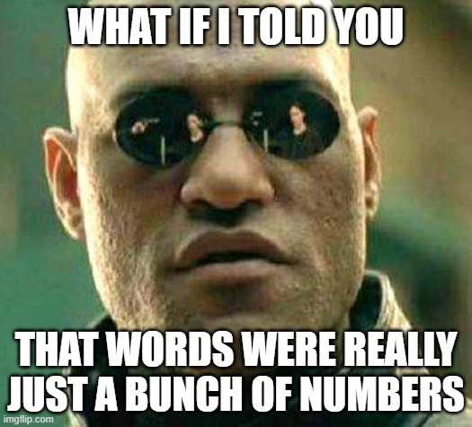

```{r setup, include=FALSE}
knitr::opts_chunk$set(echo = TRUE, warning = FALSE, message = FALSE)
```

```{r, echo = FALSE}

```

Often, we'd like to not only count the frequency of words, but also get a sense of what the words *mean*. In a [bag of words representation](bag-of-words.html), we treat words words like "president" and "executive" as separate indices in a word count vector, implicitly assuming that they have completely unique meanings. But the statistical models we use to understand text data will perform better if words with similar meaning have similar representations. That is the purpose of the **embeddings** approach, which represents each word (or document) as a vector, encoding the fact that "president" and "executive" have some overlapping meaning by placing their vectors close together.

In this exercise, we'll work with a set of pretrained text embeddings from [OpenAI](https://platform.openai.com/docs/guides/embeddings). These off-the-shelf embeddings tend to do a pretty good job at capturing meaning, even for political science specific applications [@rodriguezWordEmbeddingsWhat2021].[^federalist]

[^federalist]: See `code/03_word-embeddings/federalist-embeddings.R` if you are interested in how to train word embeddings on your own corpus.

```{r}
library(tidyverse)
library(tidytext)
library(fuzzylink)
```

The [fuzzylink](https://joeornstein.github.io/software/fuzzylink/) R package contains a convenience function called `get_embeddings()` which we will use for this exercise. You will need an account with OpenAI and an API key. Once you have your API key, you should save it to your R environment with the following line of code (pasting in your key):

```
fuzzylink::openai_api_key('<YOUR API KEY GOES HERE>', install = TRUE)
```

For more information on setup, see the package documentation.

## Retrieving Embeddings

To retrieve text embeddings, create a list of words you want to embed, and input the list into the `get_embeddings()` funtion. The result is a matrix where each row is a 256-dimensional vector representing its meaning

```{r}
words <- c('president', 'executive', 'legislative',
           'judicial', 'banana')

embeddings <- get_embeddings(words)

embeddings['president',]
```

It's difficult to visualize and interpret a 256-dimensional vector space, but we can explore which words have similar meaning by looking at their cosine similarity. The `get_similarity_matrix()` function returns cosine similarity for each pair of vectors in an embedding matrix (or a subset of those vectors if you prefer)

```{r}
get_similarity_matrix(embeddings)

get_similarity_matrix(embeddings,
                      'president',
                      c('executive', 'banana'))
```

This is how large language models like ChatGPT encode meaning, and it seems to do a pretty good job! Pairs of words with similar meaning have higher cosine similarity scores. In the next module we'll explore how to use these embedding representations to fit models for discovery, prediction, measurement, and inference.

## Practice Problems

1.  Explore some of the stereotypes reflected in the OpenAI embeddings. How close is the word "professor" to female names compared to male names? Hispanic names?
2.  What about words that are ambiguous without context, like "bill" or "share"? What are their nearest neighbors?

## Further Reading

-   @grimmerTextDataNew2021, Chapter 8.

-   [Hvitfeldt & Silge](https://smltar.com/embeddings.html), Chapter 5.
